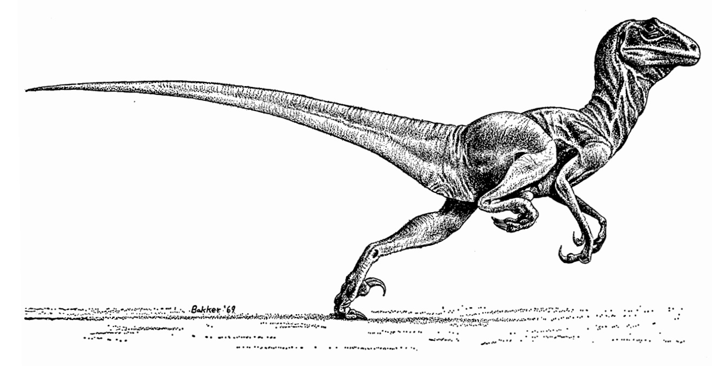

<h1 align="center">DinoVMM</h1>

    <em>Lightweight Virtual Machine Monitor. Built on KVM, Ready to Spawn.</em>

    
    
    

    

---

## Table of Contents
- [Table of Contents](#table-of-contents)
- [Overview](#overview)

## Overview